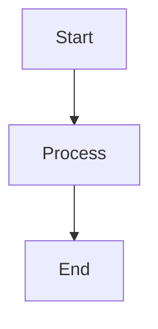

# Diagram & Visualization Workspace

A prompt-driven workflow for creating diagrams, charts, slides, and presentations using AI assistance.

## Project Structure

```
diagram_viz_support/
├── diagrams/          # Mermaid diagrams (markdown .md files)
├── charts/            # Vega-Lite specs (.vl.json)
├── slides/            # Marp markdown slides (.md)
├── scripts/           # Python scripts for pptx generation
├── outputs/           # Generated files (png, svg, pptx, pdf)
└── .vscode/          # VS Code configuration
```

## Supported Visualization Types

### 1. Mermaid Diagrams (diagrams/)

Create flowcharts, sequence diagrams, ER diagrams, and system architectures using Markdown files with Mermaid code blocks.

**File Format:**
```markdown
# My Diagram Title


```

**Example Prompts:**
- "Create a flowchart showing the user authentication process"
- "Generate a sequence diagram for a REST API request/response cycle"
- "Draw an ER diagram for a blog database with users, posts, and comments"
- "Create a system architecture diagram showing microservices communication"

**Preview in VS Code:**
1. Open the `.md` file containing your diagram
2. Press `Cmd+Shift+V` (Mac) or `Ctrl+Shift+V` (Windows/Linux)
3. Or click the preview icon in the top-right corner

**Export:** Use Mermaid CLI to export to PNG/SVG:
```bash
mmdc -i diagrams/example.md -o outputs/example.png
```

**Alternative:** Copy the mermaid code and paste into [mermaid.live](https://mermaid.live) for instant preview and export

### 2. Vega-Lite Charts (charts/)

Create interactive data visualizations with declarative JSON specs.

**Example Prompts:**
- "Create a bar chart comparing Q1-Q4 revenue for 2024"
- "Generate a line chart showing temperature trends over 12 months"
- "Make a scatter plot correlating hours studied vs test scores"
- "Create a pie chart showing market share distribution"

**Preview in VS Code:**
1. Open the `.vl.json` file
2. Press `Cmd+Shift+P` and type "Vega: Open Preview"
3. Or right-click in the file and select "Vega: Open Preview"
4. The chart will render in a preview pane

**Export:** Use vega-cli to render charts:
```bash
vl2png charts/example.vl.json outputs/example.png
```

### 3. Marp Slides (slides/)

Create simple, beautiful slide decks using Markdown.

**Example Prompts:**
- "Create a 5-slide presentation introducing our new product"
- "Generate slides explaining the software development lifecycle"
- "Make a deck with our Q4 results including charts and diagrams"
- "Create an onboarding presentation for new engineers"

**Preview in VS Code:**
1. Open the `.md` slide file
2. Click the "Open Marp Preview" icon in the top-right
3. Or press `Cmd+Shift+V` and the Marp extension will render it

**Important Notes:**
- ⚠️ Marp doesn't support Mermaid diagrams natively in preview
- For diagrams in slides, use ASCII art, emoji layouts, or export Mermaid diagrams as images and include them
- Tables, lists, and basic markdown work perfectly

**Export:** Marp can export to HTML, PDF, or PPTX:
```bash
marp slides/example.md -o outputs/example.pdf
marp slides/example.md -o outputs/example.pptx
```

### 4. Python-PPTX Presentations (scripts/)

Generate rich, data-driven PowerPoint presentations programmatically.

**Example Prompts:**
- "Create a Python script to generate a sales report presentation with charts"
- "Generate a PPTX with our quarterly metrics including tables and graphs"
- "Make a presentation script that visualizes survey results"
- "Create a data dashboard presentation with matplotlib charts"

**Run Scripts:**
```bash
cd scripts
python -m venv .venv
source .venv/bin/activate  # On Windows: .venv\Scripts\activate
pip install -r requirements.txt
python example_pptx.py
```

## Getting Started

### Prerequisites

1. **VS Code Extensions** (recommended via `.vscode/extensions.json`):
   - Markdown Mermaid for diagram preview
   - Marp for VS Code for slides
   - Vega Viewer for chart preview
   - Python extension

2. **Optional Command-Line Tools**:
   - [Mermaid CLI](https://github.com/mermaid-js/mermaid-cli): `npm install -g @mermaid-js/mermaid-cli`
   - [Vega CLI](https://vega.github.io/vega/usage/): `npm install -g vega vega-lite vega-cli`
   - [Marp CLI](https://github.com/marp-team/marp-cli): `npm install -g @marp-team/marp-cli`

### Workflow

1. **Prompt Claude** with your visualization needs using the example prompts above
2. **Save outputs** to the appropriate directory (diagrams/, charts/, slides/, scripts/)
3. **Preview** in VS Code using the recommended extensions
4. **Export** to outputs/ folder for sharing or embedding
5. **Version control** your source files (git automatically ignores generated outputs)

## Tips for Effective Prompts

- **Be specific** about data, labels, colors, and layout preferences
- **Include sample data** when creating charts or tables
- **Specify the audience** and purpose for slides/presentations
- **Request iterations**: "Make the colors more vibrant" or "Add annotations to highlight X"
- **Combine types**: "Create a Marp slide deck that includes this Mermaid diagram"

## Examples

Check out the example files to see working samples:
- `diagrams/example.md` - System architecture flowchart
  → Press `Cmd+Shift+V` to preview
- `charts/example.vl.json` - Monthly revenue bar chart
  → Press `Cmd+Shift+C` → "Vega: Open Preview"
- `slides/example.md` - Product overview deck
  → Click Marp preview icon or `Cmd+Shift+V`
- `scripts/example_pptx.py` - Automated presentation generator
  → Run: `cd scripts && python example_pptx.py`

## Contributing

This workspace is designed to evolve. Add new examples, improve scripts, or extend the workflow to suit your needs.

---

**Happy visualizing! 📊🎨**
