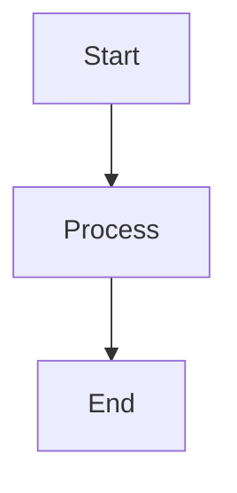

# Diagram & Visualization Workspace

A prompt-driven workflow for creating diagrams and charts using AI assistance.

## Project Structure

```
diagram_viz_support/
├── diagrams/          # Mermaid diagrams (markdown .md files)
├── drawio/            # Draw.io diagrams (.drawio files)
├── charts/            # Vega-Lite specs (.vl.json)
├── docs/              # PDF documents and reference materials
├── outputs/           # Generated files (png, svg, pdf)
└── .vscode/          # VS Code configuration
```

## Supported Visualization Types

### 1. Mermaid Diagrams (diagrams/)

Create flowcharts, sequence diagrams, ER diagrams, and system architectures using Markdown files with Mermaid code blocks.

**File Format:**
```markdown
# My Diagram Title


```

**Example Prompts:**
- "Create a flowchart showing the user authentication process"
- "Generate a sequence diagram for a REST API request/response cycle"
- "Draw an ER diagram for a blog database with users, posts, and comments"
- "Create a system architecture diagram showing microservices communication"

**Preview & Export:**
- Press `Cmd+Shift+V` to open Markdown Preview
- Click the **≡** (three lines) menu in the **bottom-right** of the preview pane
- Then use:
  - **Open in Browser**
  - **Export HTML**
  - **Export Chrome/Puppeteer PDF**

### 2. Draw.io Diagrams (drawio/)

Create rich, visual diagrams with full drag-and-drop editing directly in VS Code.

**File Format:** `.drawio` files (native Draw.io format)

**Example Prompts:**
- "Create a network architecture diagram with routers and firewalls"
- "Design a detailed UML class diagram for our application"
- "Make a comprehensive system diagram with custom icons"
- "Create an infrastructure diagram with AWS/Azure components"

**Edit in VS Code:**
1. Create or open a `.drawio` file
2. VS Code opens the visual editor automatically
3. Drag, drop, and style shapes visually
4. Save with `Cmd+S`

**Export:**
- Right-click canvas → **Export** → Choose PNG, SVG, or PDF
- Exports save to `outputs/` folder

**Convert from Mermaid:**
- Use `diagrams/*-drawio.md` files (stripped of styling)
- Copy code → Draw.io → **Arrange → Insert → Mermaid**
- Then style manually in Draw.io

**When to use Draw.io vs Mermaid:**
- **Use Mermaid**: Quick diagrams, version control, code-based, AI-friendly
- **Use Draw.io**: Complex visuals, custom styling, detailed layouts, presentations

### 3. Vega-Lite Charts (charts/)

Create interactive data visualizations with declarative JSON specs.

**Example Prompts:**
- "Create a bar chart comparing Q1-Q4 revenue for 2024"
- "Generate a line chart showing temperature trends over 12 months"
- "Make a scatter plot correlating hours studied vs test scores"
- "Create a pie chart showing market share distribution"

**Preview in VS Code:**
- Press `Cmd+Shift+C` to open Vega preview
- The chart will render in a preview pane

**Export:** Use vega-cli to render charts:
```bash
vl2png charts/example.vl.json outputs/example.png
```

## Getting Started

### Prerequisites

1. **VS Code Extensions** (recommended via `.vscode/extensions.json`):
   - Markdown Mermaid for Mermaid diagram preview
   - Draw.io Integration for visual diagram editing
   - Vega Viewer for chart preview
   - PDF Viewer for reading documents
   - GitHub Copilot & Copilot Chat for AI assistance (requires subscription)

2. **Optional Command-Line Tools**:
   - [Mermaid CLI](https://github.com/mermaid-js/mermaid-cli): `npm install -g @mermaid-js/mermaid-cli`
   - [Vega CLI](https://vega.github.io/vega/usage/): `npm install -g vega vega-lite vega-cli`

### Workflow

1. **Prompt Claude** with your visualization needs using the example prompts above
2. **Save outputs** to the appropriate directory (diagrams/, drawio/, charts/)
3. **Preview** in VS Code using the recommended extensions
4. **Export** to outputs/ folder for sharing or embedding
5. **Version control** your source files (git automatically ignores generated outputs)

## Tips for Effective Prompts

- **Be specific** about data, labels, colors, and layout preferences
- **Include sample data** when creating charts or tables
- **Request iterations**: "Make the colors more vibrant" or "Add annotations to highlight X"
- **Choose the right tool**: Mermaid for quick/code-based, Draw.io for detailed visual design

## PDF Reading & AI Assistance

### Reading PDFs in VS Code

**View PDFs:**
1. Place PDF files in `docs/` folder
2. Click to open - PDF viewer loads automatically
3. Navigate, zoom, search within PDF

**For PDF Summaries:**
- Use **NotebookLM** (https://notebooklm.google.com/) for comprehensive PDF analysis
- Upload PDFs to NotebookLM for:
  - Summaries and explanations
  - Key points extraction
  - Q&A about document content
  - Multi-document synthesis


### AI-Assisted Workflow

1. **Read Documentation**: Upload PDFs to NotebookLM for summaries and analysis
2. **Design Architecture**: Ask Claude to create Mermaid/Draw.io diagrams
3. **Build Visualizations**: Claude creates charts and data visualizations
4. **Write Code**: Copilot assists with implementation
5. **Refine & Iterate**: Ask either AI for improvements

## Examples

Check out the example files to see working samples:
- `diagrams/example.md` - System architecture flowchart
  → Press `Cmd+Shift+V` to preview
- `charts/example.vl.json` - Monthly revenue bar chart
  → Press `Cmd+Shift+C` → "Vega: Open Preview"

## Contributing

This workspace is designed to evolve. Add new examples, improve scripts, or extend the workflow to suit your needs.

---

**Happy visualizing! 📊🎨**
