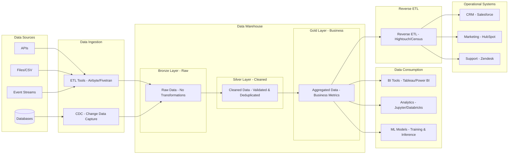

# Data Engineering Pipeline (Draw.io Compatible)

This is a Draw.io-compatible version without styling. Copy the code below and paste into Draw.io → Insert → Mermaid.



## Changes for Draw.io Compatibility

- ✅ Removed all `style` statements
- ✅ Removed emoji icons (🥉🥈🥇)
- ✅ Simplified `<br/>` tags to single words
- ✅ Kept all connections and flow logic

## To Use in Draw.io

1. Copy the mermaid code above (between the ```mermaid markers)
2. Open Draw.io → **Arrange → Insert → Advanced → Mermaid**
3. Paste the code
4. Click **Insert**
5. **Manually add colors** in Draw.io after insertion

## Manual Styling in Draw.io

After inserting, you can manually style in Draw.io:
- Right-click shapes → **Edit Style**
- Change fill colors, borders, fonts
- This gives you full visual control!
