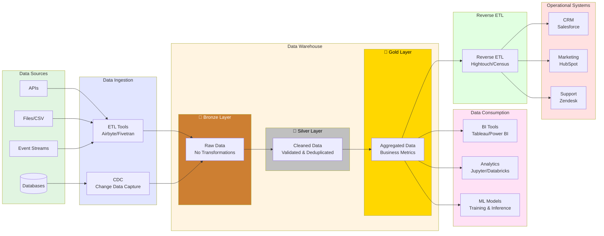

# Data Engineering Pipeline Architecture

This diagram shows a modern data pipeline with medallion architecture (Bronze/Silver/Gold layers), visualization, and reverse ETL.

## Pipeline Stages

### 1. **Data Sources**
- APIs, databases, files, event streams
- Raw operational data from various systems

### 2. **Data Ingestion**
- ETL/ELT tools (Airbyte, Fivetran, dbt)
- Change Data Capture (CDC) for real-time updates

### 3. **Data Warehouse - Medallion Architecture**

#### 🥉 Bronze Layer (Raw)
- Raw, unprocessed data
- Exact copy from sources
- Immutable historical record

#### 🥈 Silver Layer (Cleaned)
- Cleaned and validated data
- Deduplicated records
- Type conversions applied
- Basic business rules enforced

#### 🥇 Gold Layer (Business)
- Aggregated, business-ready data
- Calculated metrics and KPIs
- Optimized for reporting
- Star/snowflake schema

### 4. **Data Consumption**
- BI dashboards and reports
- Ad-hoc analytics and exploration
- Machine learning model training

### 5. **Reverse ETL**
- Push enriched data back to operational systems
- Close the data loop
- Enable data-driven workflows in business tools

## Technologies

**Data Warehouse:** Snowflake, BigQuery, Databricks, Redshift
**ETL/ELT:** Airbyte, Fivetran, dbt, Apache Airflow
**Reverse ETL:** Hightouch, Census, Grouparoo
**BI Tools:** Tableau, Power BI, Looker, Metabase

## How to View

Press `Cmd+Shift+V` in VS Code to preview this diagram.
