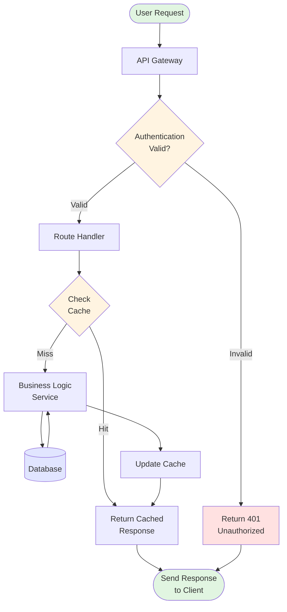

# System Architecture Diagram

This diagram shows a typical API request flow with caching and authentication.

## How to View

1. **In VS Code**: Open this file and click the preview button (top-right icon) or use `Cmd+Shift+V`
2. **Export**: Use Mermaid CLI or copy to [mermaid.live](https://mermaid.live) for PNG/SVG export
