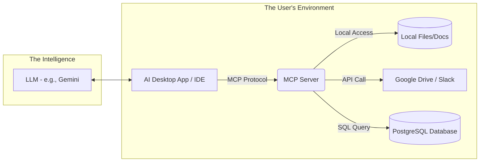
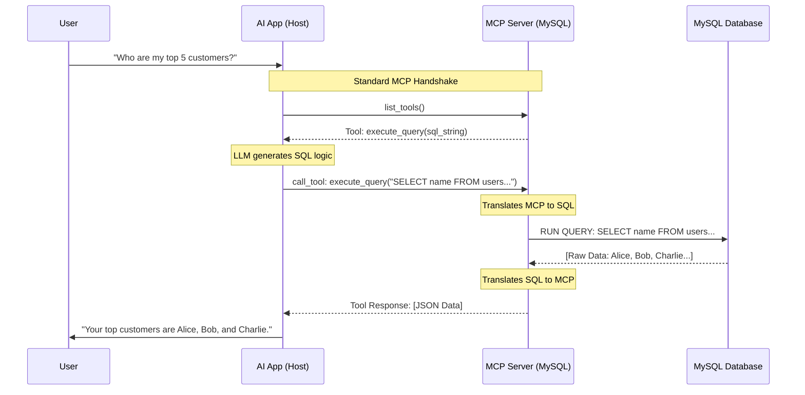

# MCP (Model Context Protocol) Architecture

This diagram illustrates the architecture of the Model Context Protocol, showing how AI applications interact with various data sources through MCP servers.

## Architecture Overview

The MCP architecture consists of two main components:

1. **The User's Environment**: Where the AI application runs and connects to data sources
2. **The Intelligence**: The LLM that powers the AI interactions

## Diagram

## Components

- **AI Desktop App / IDE**: The user-facing application that integrates with the LLM
- **MCP Server**: Acts as a bridge between the AI application and various data sources
- **Data Sources**:
  - Local files and documentation
  - Cloud services (Google Drive, Slack)
  - Databases (PostgreSQL)
- **LLM**: The language model (e.g., Gemini) that processes requests and generates responses
---

# MCP Query Flow - Database Example

This sequence diagram shows the detailed flow of how an AI application uses MCP to query a MySQL database in response to a user request.

## Query Flow Overview

The diagram illustrates a complete request-response cycle:

1. User asks a natural language question
2. AI app performs MCP handshake to discover available tools
3. LLM generates appropriate SQL query
4. MCP server executes the query against the database
5. Results are translated back through MCP protocol
6. AI app presents the answer to the user

## Sequence Diagram

## Flow Stages

1. **User Request**: Natural language question from the user
2. **Tool Discovery**: Host discovers available MCP tools via `list_tools()`
3. **SQL Generation**: LLM converts the natural language query into SQL
4. **Query Execution**: MCP server translates and executes the SQL query
5. **Data Translation**: Raw database results are converted to MCP format (JSON)
6. **Response**: Formatted answer is presented to the user