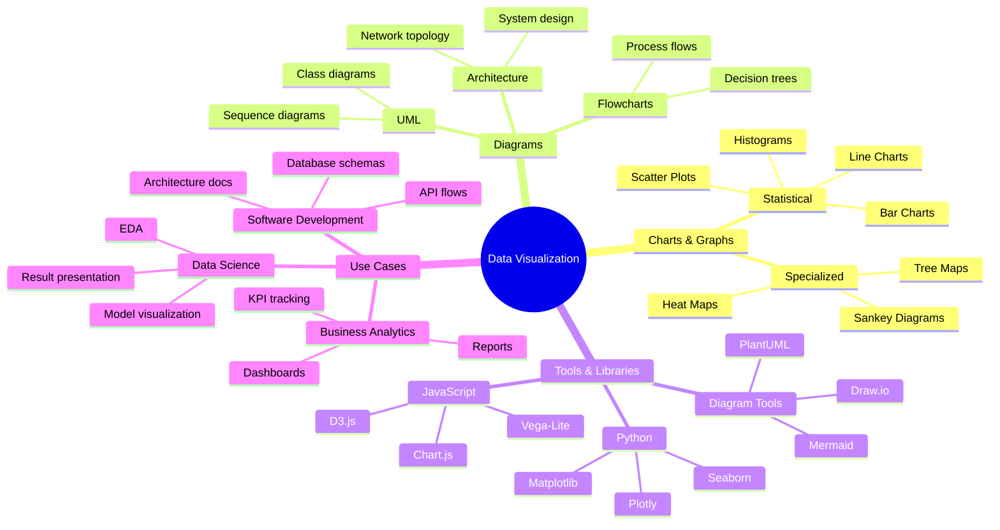

# Mindmap Example: Data Visualization Ecosystem

This mindmap shows the landscape of data visualization tools and techniques.

## About This Mindmap

This example demonstrates:
- **Root node** with cloud shape `((text))`
- **Multiple branches** from the center
- **Deep nesting** (up to 4 levels shown)
- **Clear hierarchy** for organizing information
- **Practical content** about data visualization ecosystem

## When to Use Mindmaps

Mindmaps are excellent for:
- Brainstorming and idea generation
- Organizing hierarchical information
- Project planning and breakdown
- Knowledge mapping
- Presenting categorized concepts
