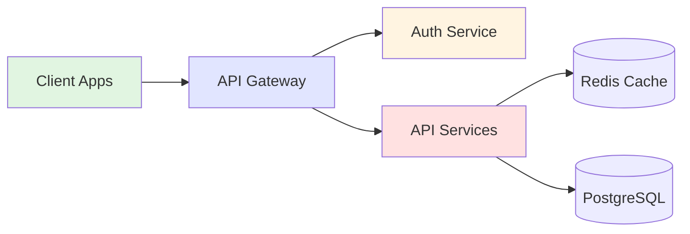

# Welcome to Our Platform
## Building the Future of Cloud Services

**Presentation Date:** February 2026
**Presenter:** Engineering Team

---

# System Architecture Overview

Our platform uses a modern microservices architecture with intelligent caching.

---

# Key Performance Metrics

| Metric | Target | Current | Status |
|--------|--------|---------|--------|
| API Latency | < 100ms | 78ms | ✅ Excellent |
| Uptime | 99.9% | 99.95% | ✅ Exceeding |
| Cache Hit Rate | > 80% | 87% | ✅ Optimal |
| Error Rate | < 0.1% | 0.04% | ✅ Great |

**All systems operating above target performance!**

---

# Revenue Growth Trends

- **Q1 2024:** $145K - Strong start
- **Q2 2024:** $186K - 28% growth
- **Q3 2024:** $216K - 16% growth
- **Q4 2024:** $248K - 15% growth

**Total Annual Revenue: $795K**
**YoY Growth: 65%**

---

# Next Steps

1. **Scale Infrastructure** - Prepare for 3x traffic growth
2. **Expand API Coverage** - Add 15 new endpoints
3. **Improve Monitoring** - Real-time alerts and dashboards
4. **Developer Experience** - Enhanced documentation and SDKs

**Questions?** Let's discuss!

---
